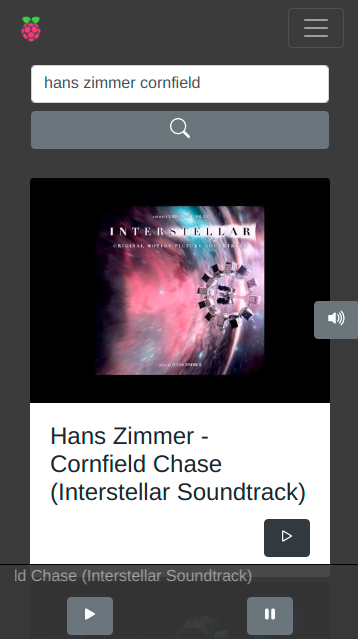

# RaspiMusic client

## Features

search and play music from YouTube

control the music from multiple devices in real time

shut down and reboot the Raspberry pi

## Screenshot



## Project setup

set static IP for the raspberry pi

set the environment variables in the .env file (sample provided):

http://[yourStaticLocalIp]:3000

[YouTube API key][1]

[1]: https://developers.google.com/youtube/v3/getting-started

run:

```
npm install
```

### Compiles and hot-reloads for development

```
npm run serve
```

### Compiles and minifies for production

```
npm run build
```
